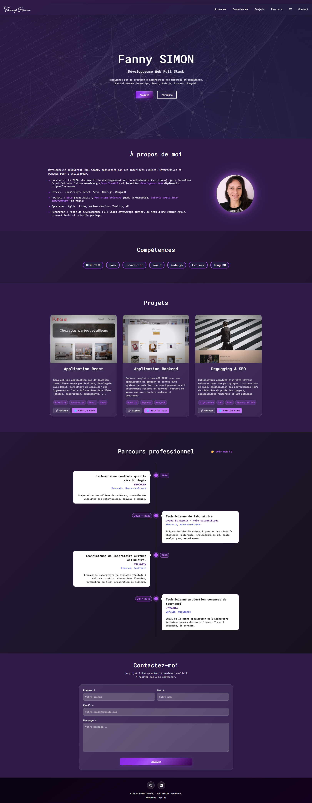

# Portfolio — Fanny Simon (Développeuse Web Full Stack)



## Démo en ligne

- **Site déployé**: [fannysimon-devweb-fullstack.netlify.app](https://fannysimon-devweb-fullstack.netlify.app)

## Objectif

Portfolio responsive présentant mon profil, mes compétences (MERN stack + technos complémentaires), mes projets (données JSON + modales) et un formulaire de contact avec envoi d’email (EmailJS).

## Stack & outils

- **Front**: React + Vite
- **Routing**: React Router DOM
- **Styles**: Sass/SCSS (mixins + variables)
- **Email**: EmailJS (`@emailjs/browser`)
- **Qualité**: ESLint

## Architecture (principaux dossiers)

```text
public/
  FS-logo.png
  meta-image.webp
src/
  Components/
    Header/  Hero/  Footer/  Modal/
    Sections/
      About/  Skills/  Projects/  History/  Contacts/
  Pages/
    Home/
  assets/
    data/        # JSON (projects, skills, experiences)
    images/      # images du site
  styles/
    _variables.scss
    _mixins.scss
    main.scss
```

## Données (JSON)

- **Projets**: `src/assets/data/projectsData.json`
- **Compétences**: `src/assets/data/skillsData.json`
- **Expériences**: `src/assets/data/experiencesData.json`

## Fonctionnalités clés

- **Navigation**: ancres + menu mobile (burger)
- **Projets**: cards générées depuis JSON, ouverture en **modal**
- **Contact**: formulaire (nom, prénom, email, message) + envoi via **EmailJS**
- **SEO / Partage**: meta tags (Open Graph / Twitter Card) + microdonnées **Schema.org via JSON-LD** dans `index.html`

## Installation & lancement

Pré-requis: Node.js + npm

```bash
npm install
npm run dev
```

Serveur Vite: `http://localhost:3001`

## Build

```bash
npm run build
npm run preview
```

## Configuration EmailJS

Le formulaire de contact utilise EmailJS. Renseignez vos identifiants (service/template/public key) dans `src/Components/Sections/Contacts/Contacts.jsx` (ou déplacez-les en variables d’environnement pour plus de sécurité).


